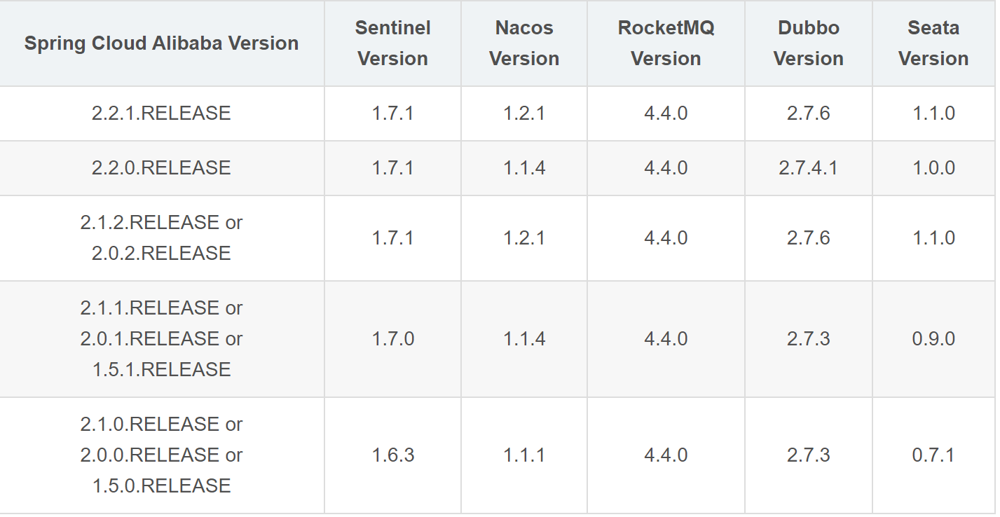
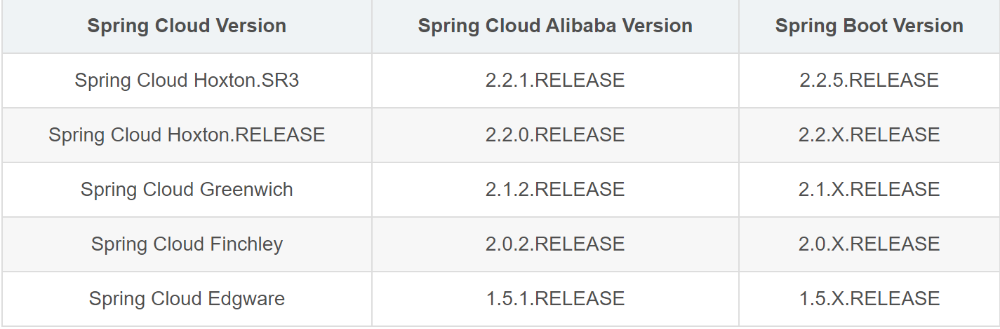

项目结构图

```
oc-auth-parent
├─oc-auth-api
│  └─src
│     └─main
│         └─java
│             └─com
│                 └─lmk
│                     └─auth
│                         └─biz
│                             └─api
├─oc-auth-app
│  └─src
│     ├─main
│     │  ├─java
│     │  │  └─com
│     │  │      └─lmk
│     │  │          └─auth
│     │  │              ├─app
│     │  │              │  ├─nacosconfig
│     │  │              │  └─nacosdiscovery
│     │  │              └─biz
│     │  │                  ├─controller
│     │  │                  ├─dao
│     │  │                  ├─mapper
│     │  │                  └─service
│     │  │                      └─impl
│     │  └─resources
│     └─test
│         └─java
│             └─com
│                 └─lmk
│                     └─auth
│                         └─app
├─oc-auth-entity
│  └─src
│     └─main
│         └─java
│             └─com
│                 └─lmk
│                     └─auth
│                         └─biz
│                             └─entity
└─oc-auth-rpc
    └─src
       └─main
           ├─java
           │  └─com
           │      └─lmk
           │          └─auth
           │              └─biz
           │                  └─rpc
           └─resources
               └─META-INF
```


# 一、创建微服务程序

## 1、父级项目

命名：oc-服务名-parent

```
oc-auth-parent
```

只有pom依赖文件

```xml
<?xml version="1.0" encoding="UTF-8"?>
<project xmlns="http://maven.apache.org/POM/4.0.0"
         xmlns:xsi="http://www.w3.org/2001/XMLSchema-instance"
         xsi:schemaLocation="http://maven.apache.org/POM/4.0.0 http://maven.apache.org/xsd/maven-4.0.0.xsd">
    <parent>
        <artifactId>ocean</artifactId>
        <groupId>com.lmk</groupId>
        <version>0.0.1-SNAPSHOT</version>
        <relativePath>../pom.xml</relativePath>
    </parent>
    <modelVersion>4.0.0</modelVersion>

    <groupId>com.lmk.conf</groupId>
    <artifactId>oc-conf-parent</artifactId>
    <packaging>pom</packaging>
    <modules>
        <module>oc-conf-api</module>
        <module>oc-conf-app</module>
        <module>oc-conf-entity</module>
        <module>oc-conf-rpc</module>
    </modules>

    <dependencies>
        <!-- https://mvnrepository.com/artifact/io.springfox/springfox-swagger2 -->
        <dependency>
            <groupId>io.springfox</groupId>
            <artifactId>springfox-swagger2</artifactId>
            <version>3.0.0</version>
        </dependency>
        <!-- https://mvnrepository.com/artifact/io.springfox/springfox-swagger-ui -->
        <dependency>
            <groupId>io.springfox</groupId>
            <artifactId>springfox-swagger-ui</artifactId>
            <version>3.0.0</version>
        </dependency>

        <dependency>
            <groupId>com.baomidou</groupId>
            <artifactId>mybatis-plus-boot-starter</artifactId>
            <version>${mybatis-plus-boot-starter.version}</version>
        </dependency>
    </dependencies>
</project>
```

## 2、API项目

```xml
<?xml version="1.0" encoding="UTF-8"?>
<project xmlns="http://maven.apache.org/POM/4.0.0"
         xmlns:xsi="http://www.w3.org/2001/XMLSchema-instance"
         xsi:schemaLocation="http://maven.apache.org/POM/4.0.0 http://maven.apache.org/xsd/maven-4.0.0.xsd">
    <parent>
        <artifactId>oc-conf-parent</artifactId>
        <groupId>com.lmk.conf</groupId>
        <version>0.0.1-SNAPSHOT</version>
        <relativePath>../pom.xml</relativePath>
    </parent>
    <modelVersion>4.0.0</modelVersion>
    <groupId>com.lmk.conf</groupId>
    <artifactId>oc-conf-api</artifactId>
    <version>0.0.1-SNAPSHOT</version>
    <packaging>jar</packaging>

    <dependencies>
        <dependency>
            <groupId>org.springframework.boot</groupId>
            <artifactId>spring-boot-starter-web</artifactId>
        </dependency>

        <dependency>
            <groupId>com.lmk.conf</groupId>
            <artifactId>oc-conf-entity</artifactId>
            <version>0.0.1-SNAPSHOT</version>
        </dependency>
    </dependencies>
</project>
```

## 3、APP项目

```xml
<?xml version="1.0" encoding="UTF-8"?>
<project xmlns="http://maven.apache.org/POM/4.0.0"
         xmlns:xsi="http://www.w3.org/2001/XMLSchema-instance"
         xsi:schemaLocation="http://maven.apache.org/POM/4.0.0 http://maven.apache.org/xsd/maven-4.0.0.xsd">
    <parent>
        <artifactId>oc-conf-parent</artifactId>
        <groupId>com.lmk.conf</groupId>
        <version>0.0.1-SNAPSHOT</version>
        <relativePath>../pom.xml</relativePath>
    </parent>
    <modelVersion>4.0.0</modelVersion>

    <groupId>com.lmk.conf</groupId>
    <artifactId>oc-conf-app</artifactId>
    <version>0.0.1-SNAPSHOT</version>
    <packaging>jar</packaging>

    <dependencies>
        <dependency>
            <groupId>org.springframework.boot</groupId>
            <artifactId>spring-boot-starter-data-mongodb</artifactId>
        </dependency>

        <dependency>
            <groupId>com.lmk.conf</groupId>
            <artifactId>oc-conf-api</artifactId>
            <version>0.0.1-SNAPSHOT</version>
        </dependency>

        <dependency>
            <groupId>com.lmk.common.web</groupId>
            <artifactId>oc-common-web</artifactId>
            <version>0.0.1-SNAPSHOT</version>
        </dependency>

        <dependency>
            <groupId>mysql</groupId>
            <artifactId>mysql-connector-java</artifactId>
            <scope>runtime</scope>
        </dependency>

        <dependency>
            <groupId>org.springframework.boot</groupId>
            <artifactId>spring-boot-starter</artifactId>
        </dependency>
        <dependency>
            <groupId>com.alibaba.cloud</groupId>
            <artifactId>aliyun-redis-spring-boot-starter</artifactId>
        </dependency>
        <dependency>
            <groupId>com.alibaba.cloud</groupId>
            <artifactId>spring-cloud-starter-alibaba-nacos-config</artifactId>
        </dependency>
        <dependency>
            <groupId>com.alibaba.cloud</groupId>
            <artifactId>spring-cloud-starter-alibaba-nacos-discovery</artifactId>
        </dependency>
        <dependency>
            <groupId>org.springframework.boot</groupId>
            <artifactId>spring-boot-starter-test</artifactId>
            <scope>test</scope>
            <exclusions>
                <exclusion>
                    <groupId>org.junit.vintage</groupId>
                    <artifactId>junit-vintage-engine</artifactId>
                </exclusion>
            </exclusions>
        </dependency>
    </dependencies>

    <build>
        <plugins>
            <plugin>
                <groupId>org.springframework.boot</groupId>
                <artifactId>spring-boot-maven-plugin</artifactId>
                <version>2.3.7.RELEASE</version>
                <executions>
                    <execution>
                        <id>repackage</id>
                        <goals>
                            <goal>repackage</goal>
                        </goals>
                    </execution>
                </executions>
            </plugin>
        </plugins>
    </build>
</project>
```

## 4、ENTITY项目

```xml
<?xml version="1.0" encoding="UTF-8"?>
<project xmlns="http://maven.apache.org/POM/4.0.0"
         xmlns:xsi="http://www.w3.org/2001/XMLSchema-instance"
         xsi:schemaLocation="http://maven.apache.org/POM/4.0.0 http://maven.apache.org/xsd/maven-4.0.0.xsd">
    <parent>
        <artifactId>oc-conf-parent</artifactId>
        <groupId>com.lmk.conf</groupId>
        <version>0.0.1-SNAPSHOT</version>
        <relativePath>../pom.xml</relativePath>
    </parent>
    <modelVersion>4.0.0</modelVersion>
    <groupId>com.lmk.conf</groupId>
    <artifactId>oc-conf-entity</artifactId>
    <version>0.0.1-SNAPSHOT</version>
    <packaging>jar</packaging>

    <dependencies>
        <dependency>
            <groupId>com.lmk.common.entity</groupId>
            <artifactId>oc-common-entity</artifactId>
            <version>0.0.1-SNAPSHOT</version>
        </dependency>
    </dependencies>
</project>
```

## 5、RPC项目

```xml
<?xml version="1.0" encoding="UTF-8"?>
<project xmlns="http://maven.apache.org/POM/4.0.0"
         xmlns:xsi="http://www.w3.org/2001/XMLSchema-instance"
         xsi:schemaLocation="http://maven.apache.org/POM/4.0.0 http://maven.apache.org/xsd/maven-4.0.0.xsd">
    <parent>
        <artifactId>oc-conf-parent</artifactId>
        <groupId>com.lmk.conf</groupId>
        <version>0.0.1-SNAPSHOT</version>
        <relativePath>../pom.xml</relativePath>
    </parent>
    <modelVersion>4.0.0</modelVersion>
    <groupId>com.lmk.conf</groupId>
    <version>0.0.1-SNAPSHOT</version>
    <artifactId>oc-conf-rpc</artifactId>
    <packaging>jar</packaging>

    <dependencies>
        <dependency>
            <groupId>com.lmk.conf</groupId>
            <artifactId>oc-conf-api</artifactId>
            <version>0.0.1-SNAPSHOT</version>
        </dependency>

        <dependency>
            <groupId>com.lmk.common.annotation</groupId>
            <artifactId>oc-common-annotation</artifactId>
            <version>0.0.1-SNAPSHOT</version>
        </dependency>

        <dependency>
            <groupId>com.lmk.common.utils</groupId>
            <artifactId>oc-common-utils</artifactId>
            <version>0.0.1-SNAPSHOT</version>
        </dependency>
        <dependency>
            <groupId>org.springframework.cloud</groupId>
            <artifactId>spring-cloud-starter-openfeign</artifactId>
        </dependency>
    </dependencies>
</project>
```

## 教程目录

- [Spring Cloud 整体架构概览](https://juejin.im/post/5d764f05e51d4561fb04bfd7)
- [Spring Cloud Eureka：服务注册与发现](https://juejin.im/post/5d78cd53f265da03d55e8351)
- [Spring Cloud Ribbon：负载均衡的服务调用](https://juejin.im/post/5d7f9006f265da03951a260c)
- [Spring Cloud Hystrix：服务容错保护](https://juejin.im/post/5d822d27e51d45621479ad92)
- [Hystrix Dashboard：断路器执行监控](https://juejin.im/post/5d88cb58f265da03e4679eff)
- [Spring Cloud OpenFeign：基于Ribbon和Hystrix的声明式服务调用](https://juejin.im/post/5d9c85c3e51d45782c23fab6)
- [Spring Cloud Zuul：API网关服务](https://juejin.im/post/5d9f2dea6fb9a04e3e724067)
- [Spring Cloud Config：外部集中化配置管理](https://juejin.im/post/5da4709af265da5baa5b06ac)
- [Spring Cloud Bus：消息总线](https://juejin.im/post/5da70d1351882509615bea34)
- [Spring Cloud Sleuth：分布式请求链路跟踪](https://juejin.im/post/5dadb4d36fb9a04e02409a7d)
- [Spring Cloud Consul：服务治理与配置中心](https://juejin.im/post/5db05582f265da4d4c20180f)
- [Spring Cloud Gateway：新一代API网关服务](https://juejin.im/post/5db6eed6518825644076d0b6)
- [Spring Boot Admin：微服务应用监控](https://juejin.im/post/5db98a2d518825649c730f81)
- [Spring Cloud Security：Oauth2使用入门](https://juejin.im/post/5dc013bae51d456e817cec30)
- [Spring Cloud Security：Oauth2结合JWT使用](https://juejin.im/post/5dc2bec6f265da4d4f65bebe)
- [Spring Cloud Security：Oauth2实现单点登录](https://juejin.im/post/5dc95a675188256e040db43f)
- [Spring Cloud Alibaba：Nacos 作为注册中心和配置中心使用](https://juejin.im/post/5dcbf7bc5188250d1f5a78ea)
- [Spring Cloud Alibaba：Sentinel实现熔断与限流](https://juejin.im/post/5dd29bece51d4561e80f9053)
- [使用Seata彻底解决Spring Cloud中的分布式事务问题](https://juejin.im/post/5dd53a9d5188255d35425a08)
- [微服务权限终极解决方案，Spring Cloud Gateway + Oauth2 实现统一认证和鉴权！](https://juejin.im/post/5f0affb6f265da231258a31d)
- [微服务聚合Swagger文档，这波操作是真的香！](https://juejin.im/post/6854573219916201997)